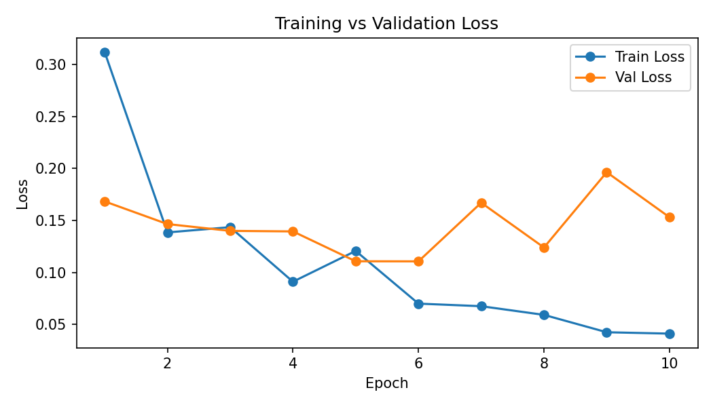
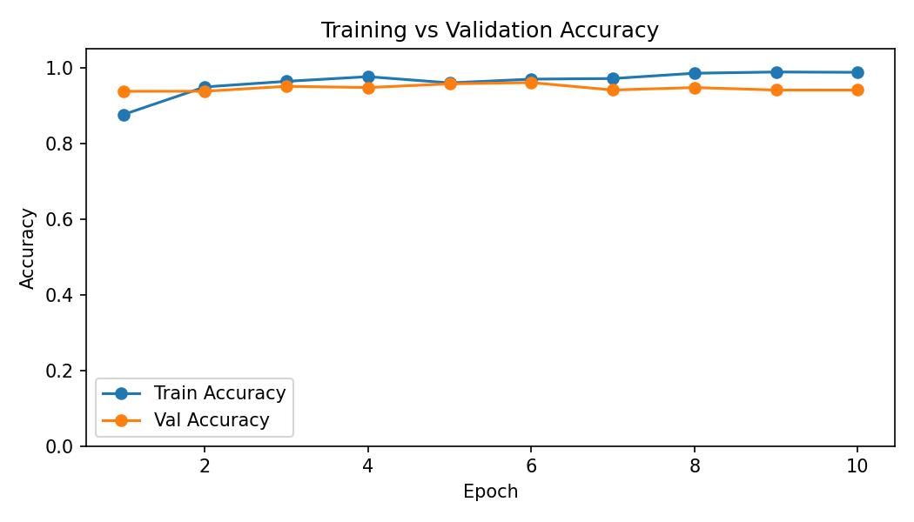
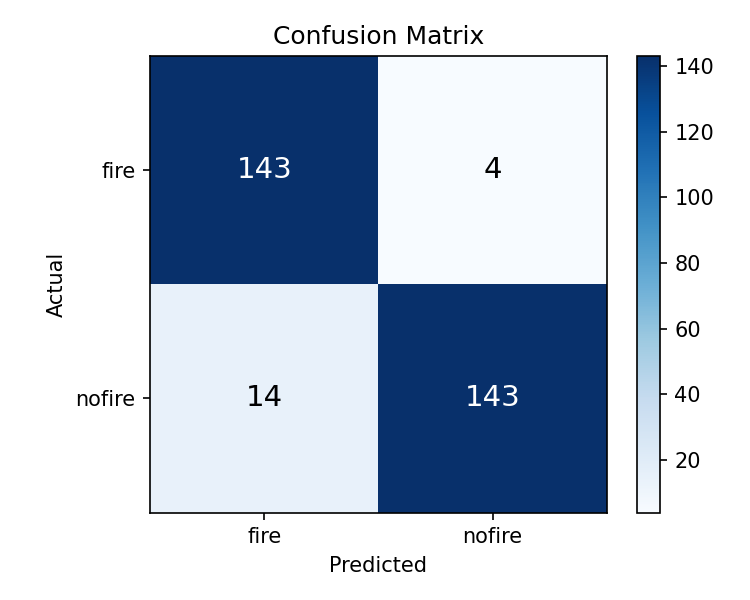
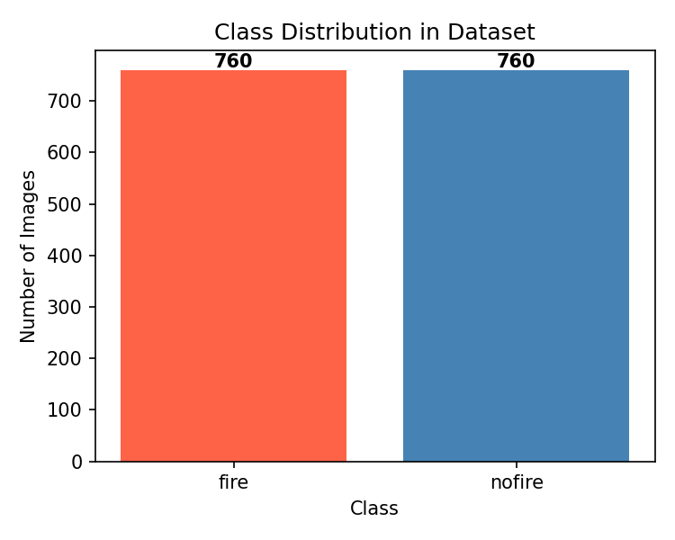

# Fire Detection CNN

A convolutional neural network that classifies images as **fire** or **no fire** with ~95%+ validation accuracy, trained on a balanced dataset of 1,520 images.

---

## Results

| Metric              | Value                                 |
| ------------------- | ------------------------------------- |
| Validation Accuracy | ~95%                                  |
| Dataset Size        | 1,520 images (760 fire / 760 no fire) |
| Training Split      | 80% train / 20% validation            |
| Epochs              | 10                                    |

### Training Curves

<p align="center">
  
  
</p>

<p align="center">
  
  
</p>

---

## Model Architecture

```
Input: (N, 3, 128, 128)
  → Conv2d(3→32, 3×3) → ReLU → MaxPool2d(2)   # 128×128 → 63×63
  → Conv2d(32→64, 3×3) → ReLU → MaxPool2d(2)  # 63×63  → 30×30
  → Flatten
  → Linear(57 600→128) → ReLU
  → Linear(128→1) → Sigmoid
Output: (N,)  — near 0 = fire, near 1 = no fire
```

Binary cross-entropy loss, Adam optimizer (default learning rate).

---

## Setup

**Prerequisites:** Python 3.9+

```bash
# 1. Clone the repository
git clone https://github.com/vineelneth/fire-detection-cnn.git
cd fire-detection-cnn

# 2. Create and activate a virtual environment (recommended)
python -m venv .venv
# Windows
.venv\Scripts\activate
# macOS / Linux
source .venv/bin/activate

# 3. Install dependencies
pip install -r requirements.txt
```

### Dataset

Organise your images in the following structure before training:

```
dataset/
└── Training/
    ├── fire/       ← fire images (.jpg / .png)
    └── nofire/     ← non-fire images (.jpg / .png)
```

> The dataset used here is a balanced subset of the
> [Fire Detection Dataset](https://www.kaggle.com/datasets/phylake1337/fire-dataset) on Kaggle.

---

## Usage

### Train

```bash
python train.py                                         # defaults (10 epochs, batch 16)
python train.py --epochs 20 --batch_size 32
python train.py --data_dir path/to/Training --output my_model.pth
```

Training saves `fire_model.pth` and four diagnostic plots under `plots/`.

**All options:**

| Flag           | Default            | Description                      |
| -------------- | ------------------ | -------------------------------- |
| `--data_dir`   | `dataset/Training` | Path to labelled training folder |
| `--epochs`     | `10`               | Number of training epochs        |
| `--batch_size` | `16`               | Mini-batch size                  |
| `--img_size`   | `128`              | Resize dimension (square)        |
| `--output`     | `fire_model.pth`   | Where to save model weights      |
| `--plots_dir`  | `plots`            | Where to save diagnostic plots   |

### Predict

```bash
# Provide an image path directly
python predict.py --image path/to/photo.jpg

# Or open a file-picker GUI (requires tkinter)
python predict.py

# Use a custom model checkpoint
python predict.py --model my_model.pth --image photo.jpg
```

---

## Project Structure

```
fire-detection-cnn/
├── model.py          # FireCNN architecture
├── train.py          # Training script
├── predict.py        # Inference script
├── requirements.txt
├── .gitignore
├── plots/            # Training diagnostic plots
│   ├── plot_accuracy.png
│   ├── plot_class_distribution.png
│   ├── plot_confusion_matrix.png
│   └── plot_loss.png
└── dataset/          # Not tracked — see Setup
    └── Training/
        ├── fire/
        └── nofire/
```

---

## License

This project is released under the [MIT License](LICENSE).
